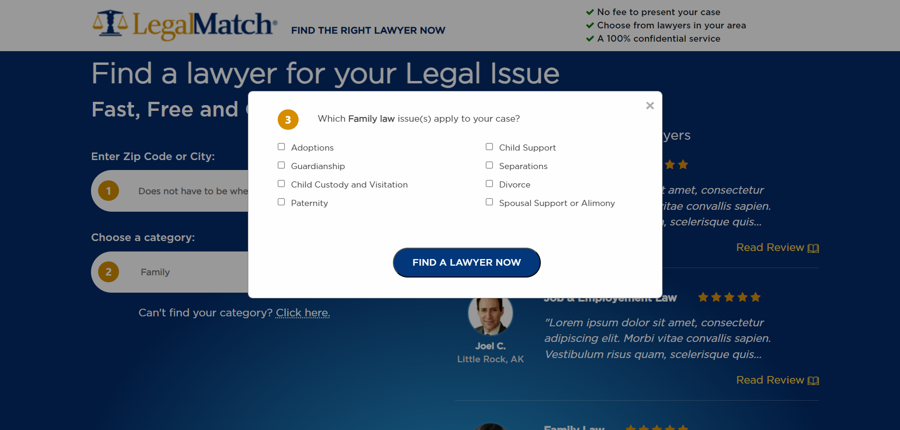

# FRONT-END DEVELOPER EXAM (PSD TO WEBPAGE)

This is a sample application that follows the Front-end technical exam guide.

## Usage

Clone the repository and open `index.html`

## Index

## Choosing a Category

## Finding a Lawyer

You will be able to go to the Find a Lawyer screen after selecting a Category

## Other Categories

This screen will appear when you click the link next to "Can't find your category?"

